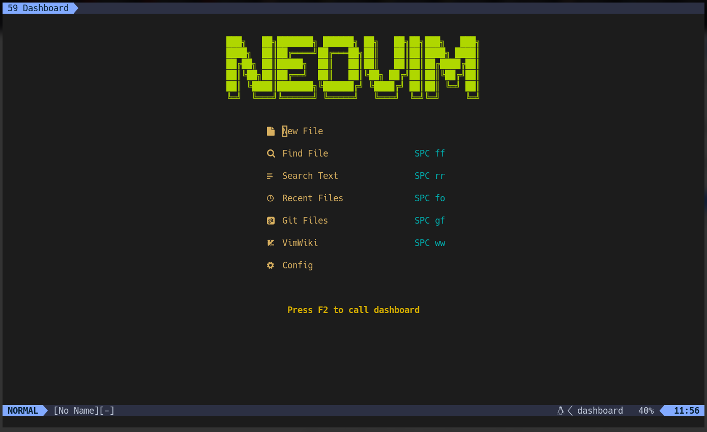
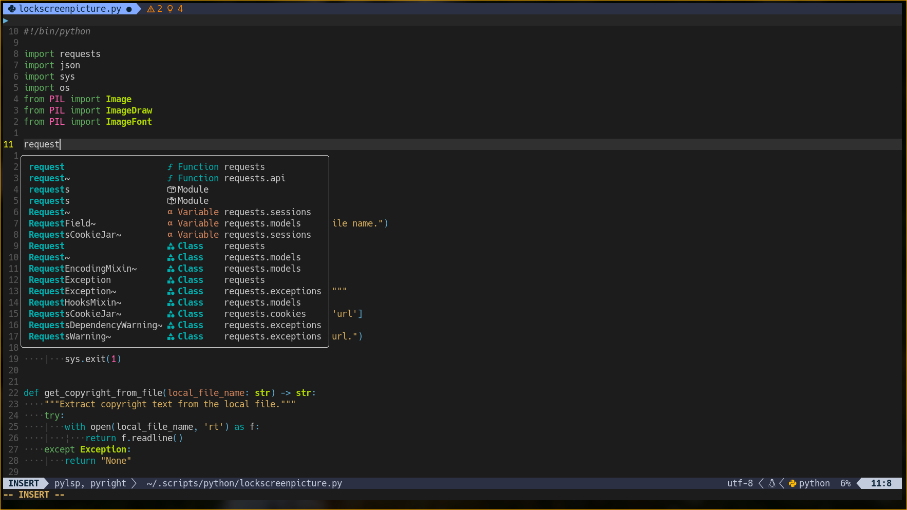
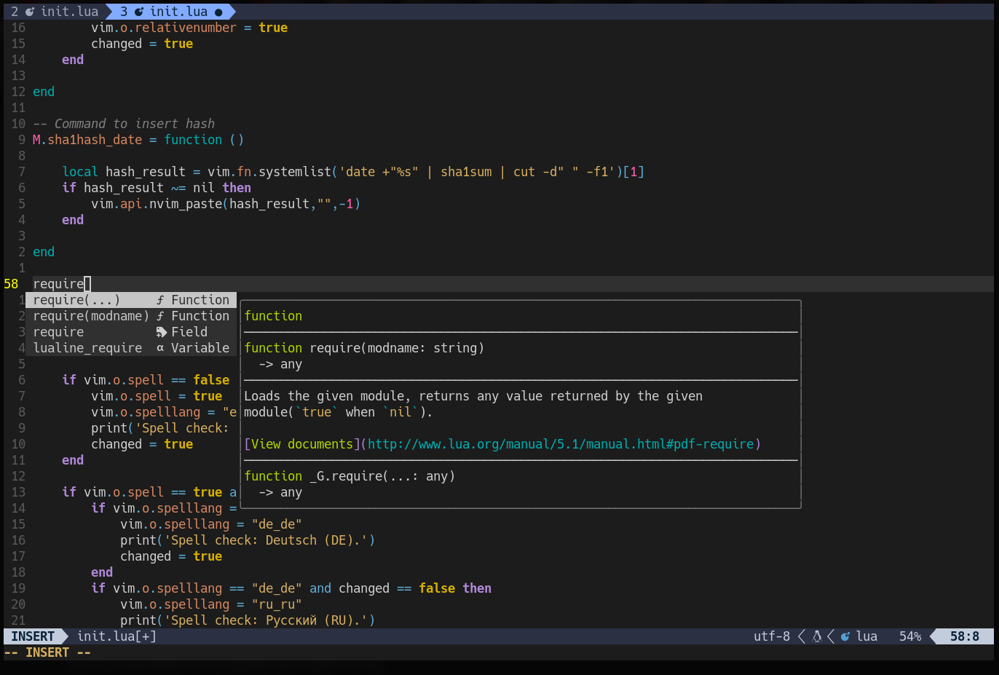
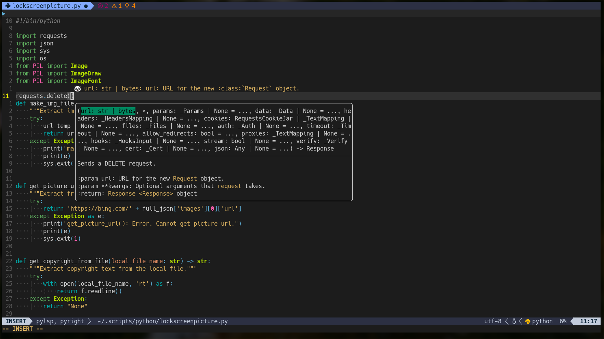
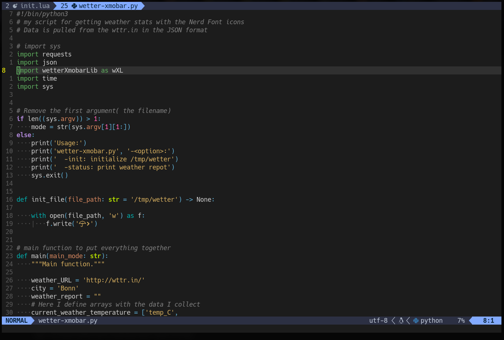
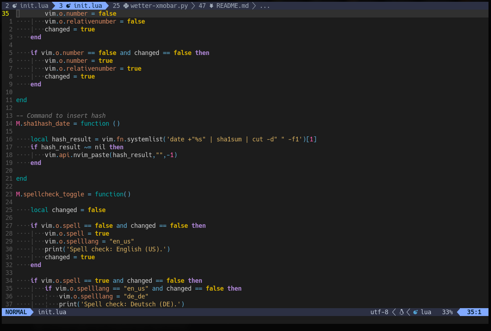
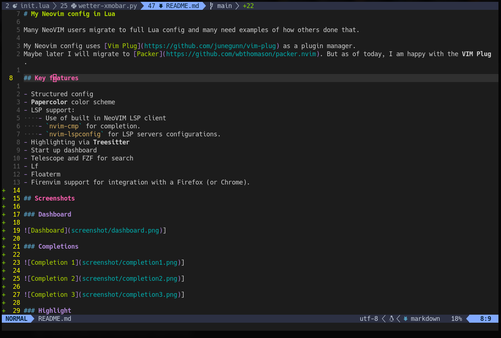

# My Neovim config in Lua

Many NeoVIM users migrate to full Lua config and many need examples of how others done that.

My Neovim config uses [Vim Plug](https://github.com/junegunn/vim-plug) as a plugin manager.
Maybe later I will migrate to [Packer](https://github.com/wbthomason/packer.nvim). But as of today, I am happy with the **VIM Plug**.

## Key features

- Structured config
- **Papercolor** color scheme
- LSP support:
    - Use of built in NeoVIM LSP client
    - `nvim-cmp` for completion.
    - `nvim-lspconfig` for LSP servers configurations.
- Highlighting via **Treesitter**
- Start up dashboard
- Telescope and FZF for search
- Lf
- Floaterm
- Firenvim support for integration with a Firefox (or Chrome).

## Screenshots

### Dashboard

]

### Completions

]

]

]

### Highlight

]

]

]
