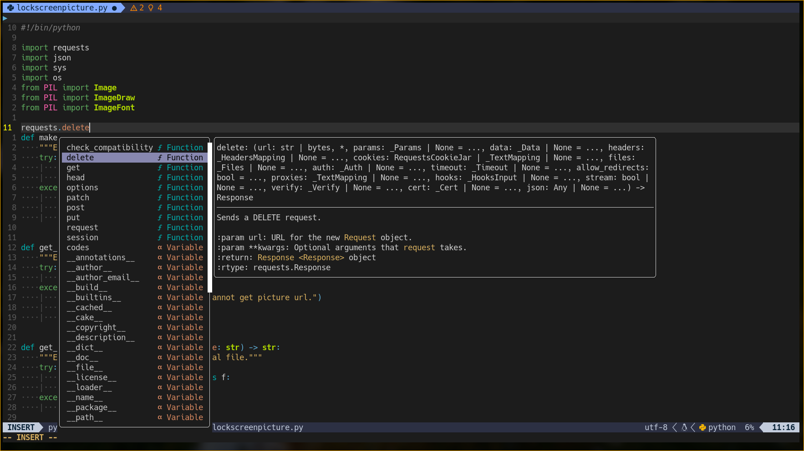

# My Neovim config in Lua

Many NeoVIM users migrate to full Lua config and many need examples of how others done that.

My Neovim config uses [Vim Plug](https://github.com/junegunn/vim-plug) as a plugin manager.
Maybe later I will migrate to [Packer](https://github.com/wbthomason/packer.nvim). But as of today, I am happy with the **VIM Plug**.

## Key features

- Structured config
- [Papercolor](https://github.com/NLKNguyen/papercolor-theme) color scheme
- LSP support:
    - Use of built in NeoVIM LSP client
    - `nvim-cmp` for completion.
    - `nvim-lspconfig` for LSP servers configurations.
    - Configuration for the following language servers: `bashls`, `yaml-language-server`, `terraform-lsp`, `pylsp` and `pyright`, ...
- Highlighting via [Treesitter](https://github.com/nvim-treesitter/nvim-treesitter)
- Start up [Dashboard](https://github.com/glepnir/dashboard-nvim)
- [Telescope](https://github.com/nvim-telescope/telescope.nvim) and [FZF](https://github.com/junegunn/fzf.vim) for search
- Floating terminal window via [Floaterm](https://github.com/voldikss/vim-floaterm)
- [Firenvim](https://github.com/glacambre/firenvim) support for integration with a Firefox (or Chrome).
- Status line and tab line with [Lualine](https://github.com/nvim-lualine/lualine.nvim)
- Indentation via [IndentLine](https://github.com/Yggdroot/indentLine)
- [Auto paring](https://github.com/Yggdroot/indentLine) for brackets, quotations, tags and other defined patters
- Gitsigns, Fugitive and integration with LazyGit for GIT.
- Treesitter
- VimWiki


## Screenshots

### Dashboard


### Completions





### Highlight


## Dependencies

### Python

Neovim specific Python tools are installed inside virtual environment.

```sh
$ python3 -m venv ~/.virtualenv/neovim
$ source ~/.virtualenv/neovim/bin/activate
$ pip install pynvim neovim-remote
$ deactivate

```
Set up the `g:python3_host_prog` variable in my `lua/config_modules/small_tunings/init.lua`:

```lua
vim.g.python3_host_prog = '/home/alexgum/.virtualenv/neovim/bin/python3'

```

### Command line tools

- [fd](https://github.com/sharkdp/fd)
- [fzf](https://github.com/junegunn/fzf)
- [ripgrep](https://github.com/BurntSushi/ripgrep)
- [ag (silver searcher)](https://github.com/mizuno-as/silversearcher-ag)
- [Exuberant Ctags](http://ctags.sourceforge.net/)
